# 低碳钢拉伸时的力学性能

低碳钢是常见的工程材料，其拉伸性能体现了典型的塑性金属行为。通过应力 - 应变曲线可以清晰地观察其力学特性，主要包括以下四个阶段以及相关性能指标。

---

## 一、四个主要阶段
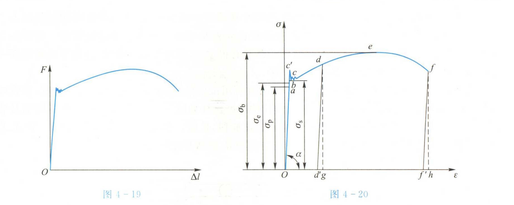
### 1. 弹性阶段（OE 段）
- **特点**：应力与应变成线性关系，服从胡克定律： $\sigma = E \varepsilon$。
- **变形特征**：完全可恢复。
- **重要参数**：
  - **比例极限 $\sigma_p$**：应力 - 应变仍成线性关系的最大应力。
  - **弹性极限 $\sigma_e$**：材料仍能完全恢复的最大应力。
  - **弹性模量 $E$**：OE 斜率。

### 2. 屈服阶段（EF 段）
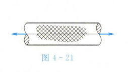
- **特点**：应力基本不变或略有波动，应变快速增长，出现明显塑性变形。
- **变形特征**：不可恢复的永久变形开始。
- **屈服点定义**：
  - **上屈服点 $\sigma_s$**：开始滑移的最大应力。
  - **下屈服点 $\sigma_t$**：滑移稳定阶段的最小应力。

### 3. 强化阶段（FG 段）
- **特点**：应力再次升高，应变继续增加，材料发生加工硬化。
- **重要参数**：
  - **强度极限（抗拉强度） $\sigma_b$**：曲线最高点，材料可承受的最大应力。

### 4. 颈缩与断裂阶段（GH 段）
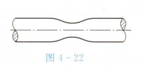
- **特点**：局部横截面收缩明显（颈缩），应力下降，最终断裂。
- **终点**：断裂点 H。

---
考虑安全的时候用屈服极限，测量E的时候用比例极限，拉断要用强度极限
## 二、主要力学性能指标
- 材料开始发生明显塑性变形的应力，对结构安全设计具有重要意义。
- 材料所能承受的最大应力，是评估材料承载能力的关键参数。
- 表示断裂后材料发生的塑性变形程度：
  $\delta = \frac{l_1 - l_0}{l_0} \times 100\%$
  其中：
  - $l_0$：原始标距
  - $l_1$：断后标距

- 表示断裂前后试件最小横截面积变化的程度：
  $\psi = \frac{A_0 - A_1}{A_0} \times 100\%$
  其中：
  - $A_0$：原始横截面积
  - $A_1$：断后最小横截面积

### 加工硬化现象
在强化阶段，位错增多，使材料抵抗塑性变形的能力增强，应力随应变增加。

# 剪切与挤压实用计算
人话来说就是：
做一个假设，切应力，挤压应力都是等于剪切力或者压力除以面积，即
$$
\sigma = \frac{F}{A}
$$
一般认为这个应力分布是均匀的（实际不是，有一个概念叫应力集中，不考）
计算出来的被称为名义切应力和名义挤压应力
一般为了安全，计算出来的应力不能超过许用应力（许用切应力，许用挤压应力）

一般需要先找A，然后计算应力，然后比较

# 扭转

## 扭转的外力以及内力

### 外力偶矩

* **外力偶矩（扭矩）**：是外力作用于物体时产生的力矩，它使物体围绕某一轴线发生旋转。通常通过施加的力和力臂的乘积来计算。
* **公式**：

  $$
  T = F \cdot r
  $$

  其中，$T$ 为扭矩，$F$ 为施加的力，$r$ 为力臂。

### 扭矩

* 扭矩是扭转中的外力矩，用于描述物体的旋转趋势。它通过对物体某一部分施加外力使其发生扭转变形。

### 扭矩图

* **扭矩图**：是力学中用于表示物体某段在不同位置所受扭矩大小的图形表示方法。

---

## 薄壁扭转，纯剪切

### 切应变

* **切应变**：指材料在剪力作用下产生的形变，单位为角度（rad）。它表示单位长度材料的扭转角度。
 扭转模量，应力除以应变（弹性模量也是\(E = \sigma / \epsilon\)）
  $$
  \gamma = \frac{r \cdot \theta}{l}
  $$

  其中，$r$ 是材料的半径，$\theta$ 是扭转角，$l$ 是物体的长度。

### 切应变胡克定律

* **切应变胡克定律**：描述剪切应力与剪切应变之间的线性关系：

  $$
  \tau = G \cdot \gamma
  $$

  其中，$\tau$ 为剪切应力，$G$ 为剪切模量，$\gamma$ 为切应变。

### 三个弹性常数的关系

* 弹性常数之间的关系如下：

  $$
  G = \frac{E}{2(1 + \mu)}
  $$

  其中，$G$ 是剪切模量，$E$ 是弹性模量，$\mu$ 是泊松比。

### 切应力互等定理

* **切应力互等定理**：该定理表明，在扭转过程中不同截面上的剪切应力与施加的扭矩分布相关，具体应力分布可以通过相关理论推导得到。

---

## 圆轴的扭转变形

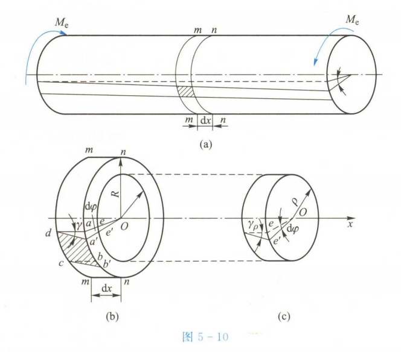

$$
\delta = \frac{aa'}{dx}\\
d\varphi = \frac{aa'}{\rho}
$$

### 极惯性矩

* **极惯性矩（$J$）**：是物体截面对抗扭转变形的几何量。对于圆形截面，极惯性矩的计算公式为：
 

  $$
  I = \frac{\pi d^4}{32}
  $$

  其中，$d$ 为圆截面的直径。

  个人更推荐使用半径
  $$
  I = \frac{\pi r^4}{2}
  $$
  记忆的话此处实际上是积分
  $$
  \iint\limits_{A} r^2 * rd\theta dr
  $$

### 扭转截面系数

* **扭转截面系数（$W_T$）**：用于描述扭转时截面对抗扭转变形的能力，计算公式为：

  $$
  W_T = \frac{I}{r}
  $$

  其中，$r$ 为截面外缘的最大半径。
  这个其实更常见，因为使用W公式可以写成\(T = \tau W_T = \frac{\tau_\rho I}{R}\)
  更加简洁，而且其实在推到的过程中就是有机会化成\(W_t\)的

### 强度和刚度计算
强度指会不会断，应力是否在一定范围以内，强度指形变\(
\theta = \varphi/\rho = \)是否在一定限度以内
* **强度计算**：基于扭转应力与许用应力进行对比，判断材料是否会发生屈服。

  $$
  \tau_{\text{max}} = \frac{T}{W_T} \leq [\tau]
  $$
* **刚度计算**：根据扭转角度与施加的扭矩来计算物体的刚度，刚度计算公式为：

  $$
  \theta = \frac{T}{G J} \leq [\varphi]
  $$

### 圆轴扭转的斜截面的应力

* 对于圆轴在扭转过程中，斜截面的应力可以通过下式计算（直接给公式，不推导）：

  $$
  \tau = \frac{T r}{J}
  $$

  其中，$T$ 为扭矩，$r$ 为截面半径，$J$ 为极惯性矩。

---

# 平面弯曲
## 剪力图，剪力图
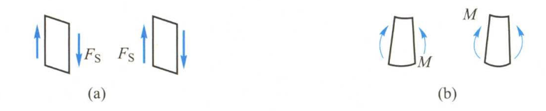
这个图描述的是剪力和弯矩的正方向，但是个人感觉描述的不是很清晰。
让我们假设所有的弯矩计算都是从左侧开始，则一下两种都是正的
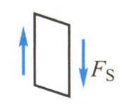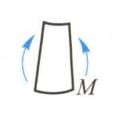
如果具有相反的趋势则是负的。
实际上，你也可以自己定义正方向，我印象里我那个力学老师说自己定义方向也是可以的，但是最好还是与教科书一致。

---
通过不断地“切割”梁，计算剖面上维持平衡所需剪力和弯矩，获得剪力方程和弯矩方程
进而绘制剪力图和弯矩图

    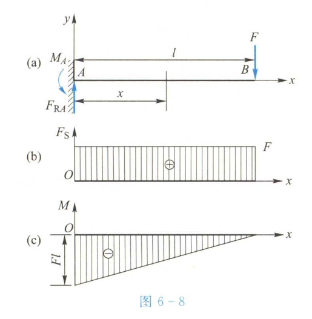
    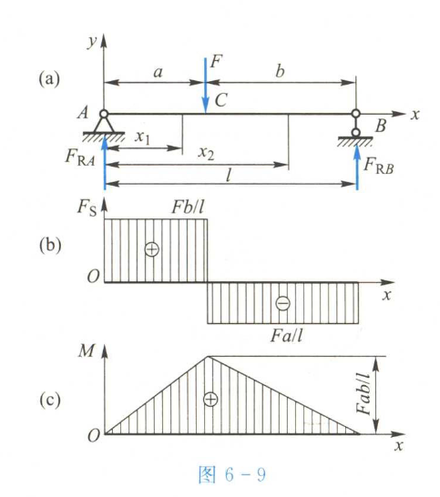

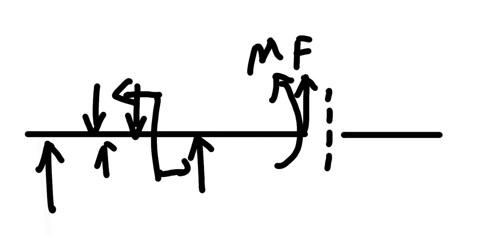
**实际上就是用一个假象的\(F\)抵消左侧所有的力，用一个M抵消所有弯矩（轴是你切的这个点）**
然后根据你假想的力和力偶的大小和正负来绘制弯矩和剪力图。

### 关于集度
$$
\frac{dF_S(x)}{dx} = q(x)\\
\frac{dM(x)}{dx} = F_S(x)\\
\frac{d^2M(x)}{dx^2} = q(x)
$$

### 方法论
1. 求支座约束力：通过平衡方程求解支座反力。
2. 分段处理：根据外力作用点将梁分段，明确每段的受力情况。
3. 绘制剪力图和弯矩图：
4. 利用分布载荷集度、剪力和弯矩间的微分关系，计算控制截面的剪力和弯矩。
5. 结合突变规律、线性规律和极值规律，绘制剪力图和弯矩图。
6. 校核：检查剪力图和弯矩图是否符合物理规律，确保结果正确。

## 平面弯曲正应力
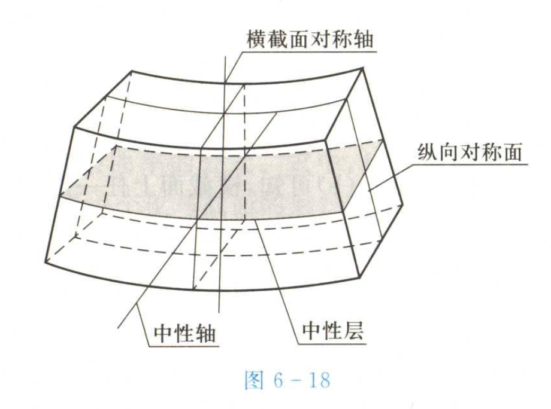
### 变形几何关系
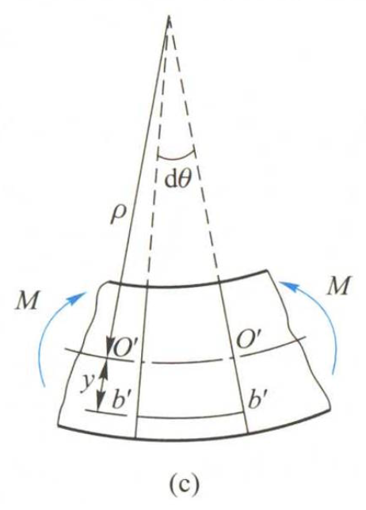
$$
\varepsilon = \frac{(\rho + y) d\theta - \rho d\theta}{\rho d\theta} = \frac{y}{\rho}
$$
\(\varepsilon\) 表示横截面上的纵向线应变，\(\rho\) 表示横截面上的曲率半径，\(y\) 表示点到中性轴的距离。
此式表明，横截面上任一点的纵向线应变 $\varepsilon$ 与该点到中性轴的距离 $y$ 成正比。

### 物理关系
$$
\sigma = E \varepsilon = E \frac{y}{\rho}
$$
\(\sigma\) 表示横截面上的纵向线应力，\(E\) 表示材料的弹性模量。
此式表明，横截面上任一点的纵向线应力 $\sigma$ 与该点到中性轴的距离 $y$ 成正比。

### 静力等效关系
$$
\frac{1}{\rho} = \frac{M}{EI_z}
$$
\(\rho\) 表示横截面上的**曲率半径**，\(M\) 表示横截面上的**弯矩**，\(I_z\)表示惯性矩，\(EI_z\) 被称为梁的**弯曲刚度**。
此式用于计算横截面上的曲率半径。
$$
\sigma = \frac{M}{I_z} y
$$
用于计算正应力。
$$
\sigma_{max} = \frac{M}{I_z} y_{max}
$$
用于计算最大正应力,在核验时，用于计算梁是否安全。

定义\(W_z = \frac{I_z}{y_{\text{max}}}
\)，则有
$$
\sigma_{\text{max}} = \frac{M}{W_z}
$$
\(W_z\) 称为**弯曲截面系数**，用于衡量梁的强度。

## 惯性矩的计算
计算y轴上的惯性矩\(I_y\)和截面系数
$$
I_y = \int_A z^2 \, \mathrm{d}A\\
W_y = \frac{I_y}{h/2}
$$
其中A为整个截面的范围，z为截面的高度，h为截面的宽度（仅对于中性面平行于两边的矩形而言）

### 矩形和圆形
截面为园型以及矩形的情况如下
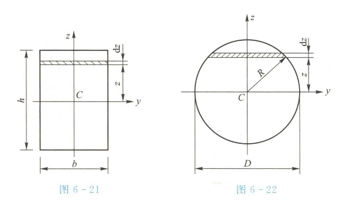
矩形(6-21图)的惯性矩以及截面系数为
$$
I_z = \frac{bh^3}{12}
$$

$$
W_z = \frac{bh^2}{6}
$$

圆形(6-22图)的惯性矩以及截面系数为
$$
I_z = I_y = \frac{\pi D^4}{64}
$$

$$
W_z = W_y = \frac{\pi D^3}{32}
$$

### 组合图形的惯性矩
感觉太难应该不会考（老师好像提到过“如果是圆形或者方形让你们算一下，其他的应该就直接给你们了”）P168

在实际工程中，很多构件的横截面是由几个简单图形（如矩形、圆形等）组合而成的，这种图形称为组合图形。计算组合图形的惯性矩需要用到平行轴定理和组合公式。

#### 平行轴定理
平行轴定理表明，平面图形对任一轴的惯性矩，等于图形对与该轴平行的形心轴的惯性矩，加上图形面积与两轴间距离平方的乘积。用公式表示为：
$$
I = I_{C} + A d^{2}
$$
其中：
- \(I\) 是平面图形对某一轴的惯性矩；
- \(I_{C}\) 是平面图形对与该轴平行的形心轴的惯性矩；
- \(A\) 是平面图形的面积；
- \(d\) 是两轴之间的垂直距离。

#### 组合公式
组合图形的惯性矩等于组成该图形的各简单图形对同一轴的惯性矩之和。即：
$$
I = \sum_{i = 1}^{n} I_{i}
$$
其中：
- \(I\) 是组合图形对某一轴的惯性矩；
- \(I_{i}\) 是第 \(i\) 个简单图形对同一轴的惯性矩；
- \(n\) 是组成组合图形的简单图形的个数。

#### 计算步骤
1. **分解图形**：将组合图形分解为若干个简单图形。
2. **确定形心轴**：确定每个简单图形的形心轴，并计算其对形心轴的惯性矩。
3. **应用平行轴定理**：若所求轴与形心轴不重合，需应用平行轴定理计算每个简单图形对所求轴的惯性矩。
4. **求和计算**：将各简单图形对所求轴的惯性矩相加，得到组合图形的惯性矩。

#### 示例

假设一个组合图形由一个矩形和一个圆形组成，求该组合图形对 \(z\) 轴的惯性矩 \(I_{z}\)。

**步骤 1：分解图形**
- 矩形：宽度为 \(b\)，高度为 \(h\)。
- 圆形：直径为 \(d\)。

**步骤 2：计算各简单图形对形心轴的惯性矩**
- 矩形对其形心轴 \(z_{1}\) 的惯性矩：\(I_{z1C} = \frac{bh^{3}}{12}\)
- 圆形对其形心轴 \(z_{2}\) 的惯性矩：\(I_{z2C} = \frac{\pi d^{4}}{64}\)

**步骤 3：应用平行轴定理**
- 设矩形形心轴 \(z_{1}\) 与 \(z\) 轴的距离为 \(d_{1}\)，则矩形对 \(z\) 轴的惯性矩为：\(I_{z1} = I_{z1C} + A_{1}d_{1}^{2} = \frac{bh^{3}}{12} + bh d_{1}^{2}\)
- 设圆形形心轴 \(z_{2}\) 与 \(z\) 轴的距离为 \(d_{2}\)，则圆形对 \(z\) 轴的惯性矩为：\(I_{z2} = I_{z2C} + A_{2}d_{2}^{2} = \frac{\pi d^{4}}{64} + \frac{\pi d^{2}}{4} d_{2}^{2}\)

**步骤 4：求和计算**
组合图形对 \(z\) 轴的惯性矩为：\(I_{z} = I_{z1} + I_{z2} = \frac{bh^{3}}{12} + bh d_{1}^{2} + \frac{\pi d^{4}}{64} + \frac{\pi d^{2}}{4} d_{2}^{2}\)

通过以上方法，就可以计算出组合图形的惯性矩。不过正如老师所说，考试中如果遇到复杂图形，可能会直接给出惯性矩的值。 

略
## 平面弯曲**切应力**（不考）
这里切应力只讨论这一种理想且狭隘的情况
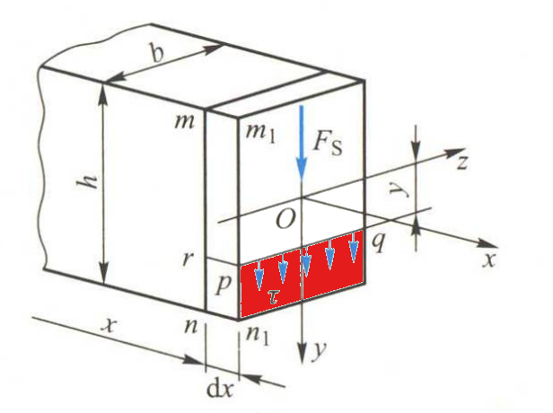
$$
\tau = \frac{F_S S_z^{*}}{I_z b}
$$
上式即为梁的弯曲切应力计算公式。式中，$F_S$ 为横截面上的**剪力**（由剪力方程或剪力图得），$b$ 为**截面宽度**，$I_z$ 为整个横截面对中性轴的**惯性矩**（前一节），$S_z^{*}$ 为横截面上距中性轴为 $y$ 处横线以外部分面积（红色部分）对中性轴 $z$ 的**静矩**，可由式 (6-20) 计算。
$$
\begin{aligned}
S_z &= \int_A y \, dA \\
S_y &= \int_A z \, dA
\end{aligned}
$$
(此处关于静矩有个简便公式，但是不适用于计算切应力，在此不提)
对于矩形有如下最大切应力，为平均切应力的1.5倍
$$
\tau_{\text{max}} = \frac{3 F_s}{2 b h}
$$
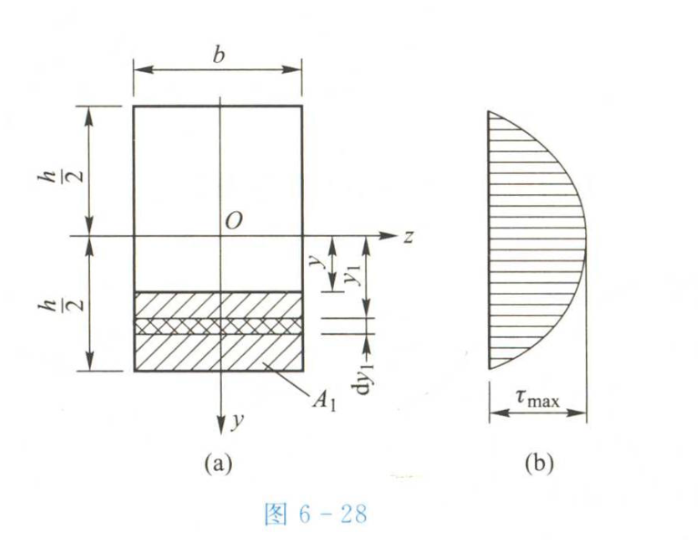
直观图像

## 梁的强度条件与合理强度设计
$$
\sigma_{\text{max}} = \left( \frac{M}{W_z} \right)_{\text{max}} \leq [\sigma]
$$

$$
\tau_{\text{max}} = \left( \frac{F_S S^*_{z_{\text{max}}}}{I_z b} \right)_{\text{max}} \leq [\tau]
$$
对于等截面直梁，可简化为以下形式
$$
\tau_{\text{max}} = \frac{F_{\text{Max}} S^*_{z_{\text{max}}}}{I_z b} \leq [\tau]
$$

$$
\sigma_{\text{max}} = \frac{M_{\text{max}}}{W_z} \leq [\sigma]
$$

## 中间两节不考

## 梁的变形
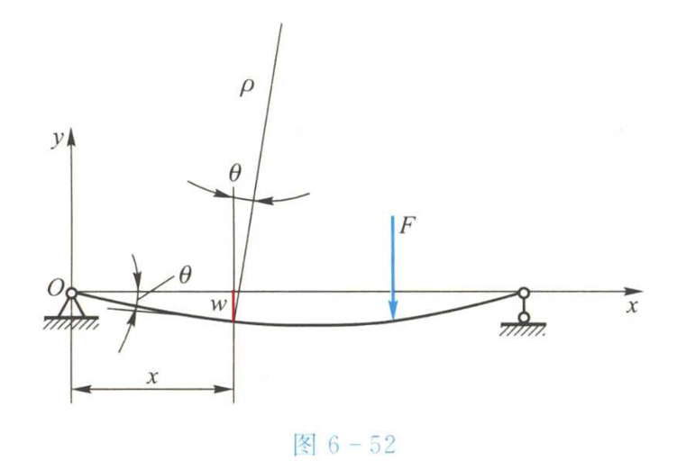
图中\(w\)为挠度（本质是一段位移）， \(w\)随\(x\)的变化而变化，所以有
$$
w = w(x)
$$
横截面角位移称为**转角**（\(\theta\)）
$$
\theta \approx \tan \theta = \frac{\mathrm{d}w}{\mathrm{d}x} = w'(x)
$$
进行一系列在0附近的近似计算后，得到
$$
w'' = \frac{M(x)}{EI}\\
EI w'' = M(x)
$$
以上公式被称为**挠曲线近似微分方程**
次方程连接了梁的挠度和弯矩，可用于在已知一方时求另一方
在计算时需要注意积分常数，利用连续条件和边界条件即可计算积分常数（利用已知位置例如两端挠度为0，且挠度是连续函数）

## 梁的刚度条件
$$
w_{\max} \leq [w] \\
\theta_{\max} \leq [\theta]
$$

# 压杆的稳定性
失稳（稳定性问题）：当轴向压力达到某一数值时（上限为理想压杆的临界载荷），突然的产生，产生很大形变
临界荷载：轴向压力超过临界荷载的时候，径向一个微小的力产生的形变在微小的力消失之后不会消失，甚至随着压力增大而增大。

## 临界载荷
临界载荷计算公式（欧拉公式）：
$$
F_{\mathrm{cr}} = \frac{\pi^2 EI}{(\mu l)^2}
$$
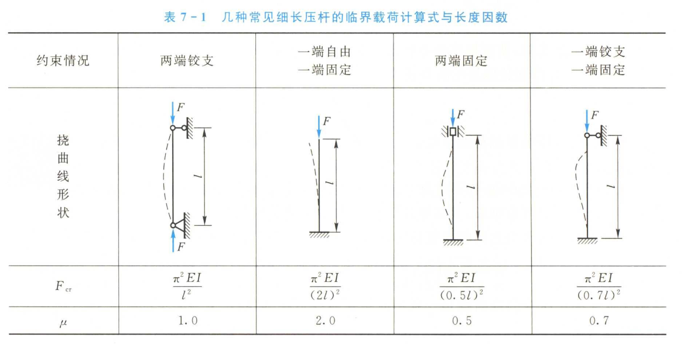
当压力达到临界载荷时，挠度有可以用以下公式计算：
$$
w = A \sin\left(\frac{\pi x}{l}\right)
$$
挠度是一个半波正弦函数，A是最大挠度（压杆中心）

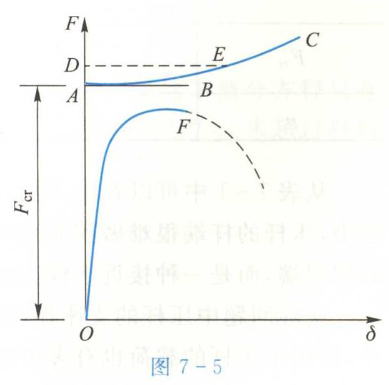
\(\delta\)为中点挠度，上边的曲线是理想情况（实际上因为使用的是近似公式，所以实际上并不完全准确，杆可能会到D点，但是不稳定，E点是稳定的），下边的曲线更接近实际情况，上边的曲线可以看成是下边曲线的上限。

## 临界应力
**临界应力**，即为临界状态下的压杆横截面的平均应力
$$
\sigma_{\mathrm{cr}} = \frac{F_{\mathrm{cr}}}{A} = \frac{\pi^2 EI}{(\mu l)^2 A}
$$
可以改写成：
$$
\sigma_{\mathrm{cr}} = \frac{\pi^2 E}{\lambda^2}
$$
其中，\(\lambda\) 是杆的柔度或者长细比
$$
\lambda = \frac{\mu l}{i^2}\\
i_z = \sqrt{\frac{I_z}{A}}, \quad i_y = \sqrt{\frac{I_y}{A}}
$$
\(i\)是惯性半径
以上公式为**临界应力欧拉公式**，其适用范围只有
$$\sigma_{er} \leq \sigma_p
$$
即压杆的临界应力未超过比例极限的时候，才能用。此范围可改写成
$$
\lambda \geq \lambda_{\mathrm{p}}\\
\lambda_{\mathrm{p}} = \pi \sqrt{\frac{E}{\sigma_{\mathrm{p}}}}
$$
满足此条件的是弹性稳定性问题，不满即为非弹性稳定性问题，这种问题理论分析存在困难，只能靠经验公式（略）。
## 压杆的稳定性条件
$$
F \leq \frac{F_{\mathrm{cr}}}{n_{\mathrm{st}}}\\
\sigma \leq \frac{\sigma_{\mathrm{cr}}}{n_{\mathrm{st}}}
$$
## 压杆的合理设计
1. 根据柔度需要选择横截面
$$
\lambda = \frac{\mu l}{i} = \mu l \sqrt{\frac{A}{I}}
$$
2. 减小压杆的长度
3. 改善杆端约束情况
4. 合理选用材料

# 动量定理以及动量矩定理

## 动量定理

### 质点的动量定理
- **动量的定义**：质点的质量 $m$ 与其速度 $\vec{v}$ 的乘积 $\vec{p} = m\vec{v}$ 称为质点的动量，动量是矢量，方向与速度方向相同。
- **质点动量定理的微分形式**：质点动量的增量等于作用于质点上的力的元冲量，即 $d\vec{p} = \vec{F}dt$。
- **质点动量定理的积分形式**：在某一时间间隔内，质点动量的变化等于作用于质点的力在此段时间内的冲量，即 $\vec{p}_2 - \vec{p}_1 = \int_{t_1}^{t_2} \vec{F}dt = \vec{I}$，其中 $\vec{p}_1$ 和 $\vec{p}_2$ 分别是质点在 $t_1$ 和 $t_2$ 时刻的动量，$\vec{I}$ 是力 $\vec{F}$ 在时间间隔 $[t_1, t_2]$ 内的冲量。

### 质点系的动量定理
- **质点系的动量**：质点系内各质点动量的矢量和称为质点系的动量，即 $\vec{P} = \sum_{i = 1}^{n} m_i\vec{v}_i$，其中 $m_i$ 和 $\vec{v}_i$ 分别是第 $i$ 个质点的质量和速度。
- **质点系动量定理的微分形式**：质点系动量的增量等于作用于质点系的所有外力元冲量的矢量和，即 $d\vec{P} = \sum_{i = 1}^{n} \vec{F}_i^{(e)}dt$，其中 $\vec{F}_i^{(e)}$ 是作用于第 $i$ 个质点的外力。
- **质点系动量定理的积分形式**：在某一时间间隔内，质点系动量的变化等于作用于质点系的所有外力在这段时间内冲量的矢量和，即 $\vec{P}_2 - \vec{P}_1 = \sum_{i = 1}^{n} \int_{t_1}^{t_2} \vec{F}_i^{(e)}dt = \sum_{i = 1}^{n} \vec{I}_i^{(e)}$。
- **质点系动量守恒定律**：若作用于质点系的所有外力的矢量和恒等于零，则质点系的动量保持不变，即 $\vec{P} = \text{常矢量}$；若作用于质点系的所有外力在某一坐标轴上投影的代数和恒等于零，则质点系的动量在该坐标轴上的投影保持不变。

## 动量矩定理
动量矩定理可以首先从分析一个正在旋转的物体下手。
有一个高为 $h$，半径为 $r$ 的圆柱体，密度为 $\rho$，其绕着 $z$ 轴旋转，那么每个质点的动量即为
$$
d\vec{p} = \vec{v} dm
$$
则，质点对 $z$ 轴的动量矩为
$$
d\vec{M}_z = \vec{r} \times d\vec{p} = \vec{r} \times \vec{v} dm
$$
其大小为
$$
dM_z = r v dm
$$
总体的动量矩为
$$
L_z = \iiint_V dM_z dV = \frac{\rho r^4\omega h \pi}{2}
$$
提出来一个 $\omega$ 之后可得
$$
L_z = \frac{\rho r^4 h \pi}{2}\omega
$$
其中 $\frac{\rho r^4 h \pi}{2}$ 即为 $J$
$$
J = \iiint_V r^2 \rho dV = \frac{\rho r^4 h \pi}{2}
$$
这就是角速度与转动惯量与角动量（动量矩）的关系
再对 $L_z$ 求导
$$
\frac{dL_z}{dt} = J\frac{d\omega}{dt} = J\alpha
$$
因为 $J\alpha = rF$（$F$ 是外力，$r$ 是力臂），所以整理一下可得
$$
\frac{dL_z}{dt} = rF = M
$$
| **线性（平动）系统**                   | ↔️ **角动量（转动）系统**                         | **对应关系说明**                                      |
| ------------------------------ | ---------------------------------------- | ----------------------------------------------- |
| **质量** $m$                     | ↔️ **转动惯量** $J$                          | 质量分布决定惯性大小                                      |
| **速度** $v$                     | ↔️ **角速度** $\omega$                      | $v = \omega r$（切向速度）                            |
| **动量** $p = mv$                | ↔️ **角动量** $L = J\omega$                 | 表示“线性/转动惯性 × 运动状态”                              |
| **合外力** $F$                    | ↔️ **合外力矩** $M$                          | 影响动量/角动量变化                                      |
| **冲量** $I = F \cdot t$         | ↔️ **角冲量** $I_\theta = M \cdot t$        | 导致动量/角动量改变                                      |
| **动能** $E_k = \frac{1}{2}mv^2$ | ↔️ **转动动能** $E_r = \frac{1}{2}J\omega^2$ | 能量形式一一对应                                        |
| **动量定理**                       | ↔️ **角动量定理**                             | $F \cdot t = \Delta p$ ↔ $M \cdot t = \Delta L$ |
| **牛顿第二定律** $F = ma$            | ↔️ **转动形式** $M = J\alpha$                | 力—加速度 ↔ 力矩—角加速度                                 |
| **守恒定律**                       | ↔️ **角动量守恒定律**                           | 无外力 ↔ 无外力矩 → 动量/角动量守恒                           |

| 平动公式（线性）                | 转动公式（角度）                     |
| ----------------------- | ---------------------------- |
| $p = mv$                | $L = J\omega$                |
| $F = ma$                | $M = J\alpha$                |
| $I = Ft$                | $I_\theta = Mt$              |
| $E_k = \frac{1}{2}mv^2$ | $E_r = \frac{1}{2}J\omega^2$ |

现在再针对轮子传动做点文章
## 解题方法概述
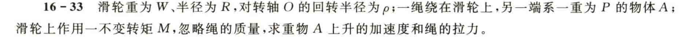
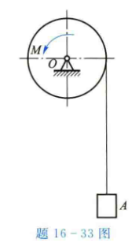
$$
M_总 = J \beta\\
M_总 = M - PR - \alpha \frac{P}{g} R\\
J = m\rho^2\\
\beta = \alpha / R
$$
可解得
$$
$$

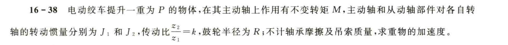
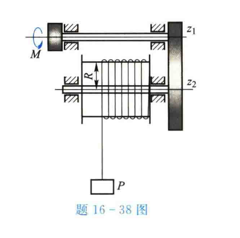

有什么不同呢？不同在于两个轮在传动，齿数不一样
但是还是可以使用\(M_总 = J \beta\)
需要注意的是，计算两个轮子之间的传递的时候要铭记**两个轮之间的作用力是作用力与反作用力**也就是，两个轮子之间的力**大小相同**方向相反。同时，两个轮子没有相对运动，\(\Delta x_1 = \Delta x_2\)也就是说一切M的比，v，a，\(\beta\)之间的比都是从此而生。
设\(\frac{z_1}{z_2} = k\)，则
$$
\frac{v_1}{v_2} = \frac{a_1}{a_2} = 1\\
\frac{\omega_1}{\omega_2} = \frac{\beta_1}{\beta_2} = 1/z\\
\frac{M_1}{M_2} = k
$$
这里的扭矩之比只是用于做运算的时候。

**此外，还有动能的计算方法**
首先，我们认为题里的机械效率为100%，则机械能守恒
$$
W = M*\theta = F*l\\
E = \frac{1}{2}mv^2 = \frac{1}{2}J\beta^2
$$

这一段总结的有没有什么问题
## 解题方法概述（含轮系传动）

我们可以从转动动力学基本公式出发：

$$
M_{\text{合}} = J_{\text{总}} \cdot \alpha
$$

其中 \( J_{\text{总}} \) 是等效转动惯量（含滑轮、轮轴、从动轮等部分），
\( \alpha \) 是所参考轴的角加速度。

例如对于滑轮系统：
$$
J = \frac{W}{g} \cdot \rho^2,\quad a = \alpha R
$$

---

### 多轮传动中的注意事项：

对于两个啮合齿轮（无滑动），有以下几组恒等关系：

| 物理量 | 关系式 |
|--------|--------|
| 切线速度 | \( v_1 = v_2 \) |
| 加速度 | \( a_1 = a_2 \) |
| 角速度 | \( \omega_1 / \omega_2 = z_2 / z_1 \) |
| 扭矩 | \( M_1 / M_2 = z_1 / z_2 \) |

由此我们可得到转动关系和扭矩传递关系。

---

### 机械能守恒法（在效率为100%时）：

若系统无摩擦损耗，动力机做的功等于系统总动能增长：

$$
W = M \cdot \theta = \frac{1}{2} J_{\text{总}} \cdot \omega^2 + \frac{1}{2} m v^2 + mgh
$$
或直接写成：
$$
\Delta E = \Delta E_{\text{动}} + \Delta E_{\text{势}} = M \cdot \theta
$$

