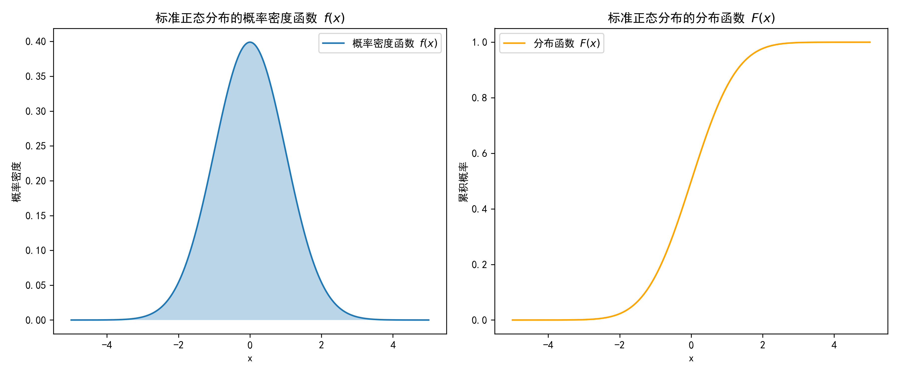

# 概率论
## 事件及运算
- 包含事件
- 并(和)事件
- 差事件
- 交(积)事件
- 互斥事件
- 对立事件
- 独立事件

### 独立事件
在概率论中,若两个事件 $A$ 和 $B$ 满足 $P(A \cap B) = P(A)P(B)$,则称这两个事件相互独立.即一个事件的发生与否不影响另一个事件发生的概率.
$$
P(A \cap B) = P(A)P(B)
$$

## 古典概型
对于事件 $A$ 的概率
$$
P(A) = \frac{\text{$A$ 的可能情况数}}{\text{所有可能情况数}}
$$

## 几何概型
通过画图,以面积做商来计算概率.
$$
P(A) = \frac{\text{$A$ 的面积}}{\text{总面积}}
$$

## 条件概率,乘法公式,全概率,贝叶斯公式

### 条件概率
条件概率描述的是在已知事件 $B$ 发生的条件下,事件 $A$ 发生的概率,用 $P(A|B)$ 表示.其计算公式为:
$$
P(A|B) = \frac{P(A \cap B)}{P(B)}
$$
其中,$P(A \cap B)$ 表示事件 $A$ 和事件 $B$ 同时发生的概率,$P(B)$ 表示事件 $B$ 发生的概率.

### 乘法公式
乘法公式是由条件概率公式推导而来的,用于计算两个事件同时发生的概率.公式如下:
$$
P(A \cap B) = P(A|B)P(B)
$$
它表明事件 $A$ 和 $B$ 同时发生的概率等于在 $B$ 发生的条件下 $A$ 发生的概率乘以 $B$ 发生的概率.

### 全概率公式
全概率公式用于计算一个复杂事件的概率,它将一个复杂事件分解为多个互斥的简单事件的概率之和.设 $\{B_1,B_2,\cdots,B_n\}$ 是样本空间 $\Omega$ 的一个划分,即 $B_i$ 两两互斥且 $\bigcup_{i = 1}^{n}B_i=\Omega$,则对于任意事件 $A$,有:
$$
P(A)=\sum_{i = 1}^{n}P(A|B_i)P(B_i)
$$
当仅考虑一个事件 $B$ 及其对立事件 $\overline{B}$ 时,公式可写为:
$$
P(A) = P(A|B)P(B) + P(A|\overline{B})P(\overline{B})
$$
其中,$\overline{B}$ 表示事件 $B$ 的对立事件.该公式表示事件 $A$ 的概率等于在 $B$ 发生条件下 $A$ 发生的概率乘以 $B$ 发生的概率,加上在 $B$ 不发生条件下 $A$ 发生的概率乘以 $B$ 不发生的概率.
也就是所有情况下$A$发生的概率之和.

### 贝叶斯公式
贝叶斯公式是在已知结果的情况下,推断导致该结果的原因的概率.公式如下:
$$
P(A|B) = \frac{P(B|A)P(A)}{P(B)}
$$
其中,$P(A|B)$ 是在 $B$ 发生的条件下 $A$ 发生的概率,$P(B|A)$ 是在 $A$ 发生的条件下 $B$ 发生的概率,$P(A)$ 是事件 $A$ 发生的先验概率,$P(B)$ 是事件 $B$ 发生的概率.

例如,假设有一个疾病检测的场景,设事件 $A$ 表示患有某种疾病,事件 $B$ 表示检测结果为阳性.通过这些公式,我们可以根据检测结果来推断患病的概率.

## 离散型随机变量分布律和分布函数
### 离散型随机变量
离散型随机变量是指取值只能是有限个或可数个的随机变量.

### 分布律
分布律是描述离散型随机变量取值及其对应的概率的函数.
e.g.
$$
P\{X = x\} = \frac{\text{事件 $X$ 取 $x$ 的次数}}{\text{所有可能的取值次数}}
$$
| \(X\) | 1 | 2 | 3 | 4 | 5 | 6 | 
| --- | --- | --- | --- | --- | --- | --- |
| \(P\) | 0.17 | 0.15 | 0.14 | 0.16 | 0.13 | 0.15 |

### 分布函数
分布函数 $F(x)$ 是描述离散型随机变量 $X$ 取值小于等于 $x$ 的累积概率的函数.若离散型随机变量 $X$ 的取值为 $x_1,x_2,\cdots$,则:
$$
F(x) = P\{X \leq x\} = \sum_{x_i\leq x} P\{X = x_i\}
$$
e.g.
$$
F(x) = \begin{cases}
0 & x < 1 \\
0.17 & 1 \leq x < 2 \\
0.32 & 2 \leq x < 3 \\
0.46 & 3 \leq x < 4 \\
0.62 & 4 \leq x < 5 \\
0.75 & 5 \leq x < 6 \\
1 & x \geq 6
\end{cases}
$$
常用左开右闭区间,单调递增

## 连续型随机变量的概率密度,分布函数
- 概率密度:描述连续型随机变量在某一点附近取值的密集程度,随机变量在某一区间取值的概率可通过概率密度函数在该区间上的积分得到
- 分布函数:随机变量小于 $x$ 的概率
e.g.

$$
F(x) = \int_{-\infty}^{x} f(t) dt = P\{X \leq x\}\\
f(x) = \frac{dF(x)}{dx}
$$
**注**:
\(f(x) = k\)并不代表\(X = x\)的概率为\(k\),对于连续随机变量,取任何值的概率都是\(0\).
\(f(x) = k\)代表在\(x\)附近的概率密度,必须乘上\(\Delta x\)才是概率.

## 随机变量的函数
基本思路:对于\(Y = g(X)\),将所有的随机变量 $X$ 通过 $g$ 变换之后,有多大概率获得 \(y_i\).

### 离散型随机变量
设随机变量 $X$ 取值为 \(x_1,x_2,\cdots\) ,则随机变量 \(Y = g(X)\) 的取值为 \(g(x_1),g(x_2),\cdots\) ,其概率分布律为:
$$
P\{Y = y\} = \sum_{g(x_i)=y} P\{X = x_i\}
$$
e.g.
| \(X\) | 0 | 1 | 2 |
| --- | --- | --- | --- |
| \(P\) | 0.3 | 0.5 | 0.2 |

设 $Y = X^2$,则 $Y$ 的分布律可根据上述公式计算得到:
| \(Y\) | 0 | 1 | 4 |
| --- | --- | --- | --- |
| \(P\) | 0.3 | 0.5 | 0.2 |

### 连续型随机变量
设随机变量\(X\)的概率密度函数为\(f(x)\),则随机变量\(Y = g(X)\)的概率密度函数为:
$$
F(y) = P\{Y \leq y\} = P\{g(X) \leq y\}
$$
解\(g(X) \leq y\)不等式,得到集合\(D\),则:
$$
P\{Y \leq y\} = \int_{D}f(x)dx
$$
由以上方法即可获得\(F(y)\),求导之后即可获得\(f(y)\)

## 5个重要的分布
### 均匀分布
X在一定区域内的概率密度是相等的:
$$
f(x) = \begin{cases}
\frac{1}{b-a} & a \leq x \leq b \\
0 & 其他
\end{cases}
$$
其中,$a$ 和 $b$ 分别为分布的下界和上界.

### 指数分布
指数分布是一种连续型概率分布,其概率密度函数为:
$$
f(x) = \begin{cases}
\lambda e^{-\lambda x} & x \geq 0 \\
0 & 其他
\end{cases}
$$
其中,$\lambda$ 是分布的参数.

注:\(\lambda\)越大,概率分布越极端
特点:
(0,k)的概率等于(a,a+k)的概率,现实中的例子就是一个新手机可以正常使用10年的概率等于一个用了10年的手机可以再正常使用10年的概率(假设手机损坏的概率符合指数分布)

### 泊松分布
泊松分布是指一个事件在一段时间内的密度是均匀的,它发生不同次数的概率符合泊松分布(泊松分布是离散的),其概率质量函数为:
$$
P(X = k) = \frac{\mu^k}{k!}e^{-\mu}
$$
其中,$\mu$ 是分布的参数.

### 二项分布
一个试验有两种可能的结果(通常称为成功和失败),在 $n$ 次独立重复试验中,每次试验成功的概率为 $p$,则成功 $k$ 次的概率为:
$$
P(X = k) = C_{n}^{k}p^k(1 - p)^{n - k}
$$
其中,$n$ 是试验次数,$p$ 是每次试验成功的概率,$k$ 是成功的次数.

### 超几何分布
超几何分布是不放回抽样下的概率分布,与二项分布(有放回抽样)不同.当总体数量 $N$ 很大,抽样数量 $n$ 相对于 $N$ 很小时,超几何分布可近似为二项分布.从含有 $N$ 个元素的总体中,其中有 $M$ 个具有某种特征的元素,不放回地抽取 $n$ 个元素,恰有 $k$ 个具有该特征元素的概率为:
$$
P(X = k) = \frac{C_{M}^{k}C_{N - M}^{n - k}}{C_{N}^{n}}
$$
其中,$N$ 是总体数量,$M$ 是总体中具有某种特征的元素个数,$n$ 是抽样数量,$k$ 是抽样中具有该特征的元素个数.

### 正态分布
正态分布是一种连续型概率分布,其概率密度函数为:
$$
f(x) = \frac{1}{\sqrt{2\pi\sigma^2}}e^{-\frac{(x-\mu)^2}{2\sigma^2}}
$$
其中,$\mu$ 是分布的均值,$\sigma$ 是分布的标准差.
记作:
$$
X \sim N(\mu,\sigma^2)
$$

- 正态分布的概率密度函数图像关于 $x = \mu$ 对称,在 $x=\mu$ 处取得最大值 $\frac{1}{\sqrt{2\pi}\sigma}$.
- 若 $X_1\sim N(\mu_1,\sigma_1^2)$,$X_2\sim N(\mu_2,\sigma_2^2)$,且 $X_1$ 与 $X_2$ 相互独立,则 $X_1 + X_2\sim N(\mu_1+\mu_2,\sigma_1^2+\sigma_2^2)$,这个性质在处理多个正态分布随机变量的和时非常有用.
- $3\sigma$ 原则:对于正态分布 $N(\mu,\sigma^2)$,有 $P(\mu-\sigma<X<\mu + \sigma)\approx0.6826$,$P(\mu - 2\sigma<X<\mu+2\sigma)\approx0.9544$,$P(\mu - 3\sigma<X<\mu + 3\sigma)\approx0.9974$,在实际应用中常用来进行质量控制等.

#### 正态分布的标准化
正态分布具有一个重要的特性——可以进行标准化变换.对于任意一个服从正态分布 $X \sim N(\mu, \sigma^2)$ 的随机变量 $X$,都可以通过线性变换将其转化为标准正态分布 $Z \sim N(0, 1)$.标准正态分布是均值为 $0$,标准差为 $1$ 的正态分布,其概率密度函数形式更为简洁,在实际计算和理论分析中应用广泛.

标准化变换的公式为:
$$
Z = \frac{X - \mu}{\sigma} \sim N(0, 1)
$$
其中,$X$ 是原始的正态分布随机变量,$\mu$ 是 $X$ 的均值,$\sigma$ 是 $X$ 的标准差,$Z$ 是经过标准化变换后服从标准正态分布的随机变量.

##### 标准化的意义
- **简化计算**:标准正态分布有专门的标准正态分布表,通过该表可以方便地查找不同 $Z$ 值对应的概率.当我们需要计算任意正态分布 $N(\mu, \sigma^2)$ 的概率时,只需先将其转化为标准正态分布,再利用标准正态分布表进行计算.
- **统一分析**:不同的正态分布可能有不同的均值和标准差,通过标准化变换可以将它们统一转化为标准正态分布,便于对不同正态分布进行比较和分析.

##### 示例
假设 $X \sim N(5, 4)$,即 $\mu = 5$,$\sigma = 2$.若要计算 $P(X \leq 7)$,可以先将 $X$ 进行标准化:
$$
Z = \frac{X - 5}{2}
$$
则 $P(X \leq 7)$ 可转化为 $P\left(Z \leq \frac{7 - 5}{2}\right) = P(Z \leq 1)$,然后通过查标准正态分布表即可得到对应的概率值.

## 二维随机变量
定义:略
说白了就是在坐标系上的一个点,x坐标和y坐标都是随机的,每个点的概率密度的积分就是**联合分布函数**,在一个区域的概率,就是在这个区域上的积分,如果是一个相邻两边分别平行于坐标轴的矩形的话就可以用几个点的联合分布函数值的加减表示.有二维随机变量\((X,Y)\),其联合分布函数为
$$
F(x,y) = P\{X \leq x,Y \leq y\} = \int_{-\infty}^{x}\int_{-\infty}^{y}f(x,y)dxdy
$$
有二维集合\(D = \{(x,y)|x_1 < x < x_2,y_1 < y < y_2\}\),则
$$
P\{X \in D\} = \int_{x_1}^{x_2}\int_{y_1}^{y_2}f(x,y)dxdy = F(x_2,y_2) - F(x_1,y_2) - F(x_2,y_1) + F(x_1,y_1)
$$
本质上可以看作有微小体积的点在一个无限大且具有坐标系上的沙盘按照一定规律落下堆成的三维图形.

在区域\(D\) 的概率就是这个沙盘上的体积.
在\((x,y)\)的概率密度就是这个点上的\(f(x,y)\)
再从左下角\((-\infty,-\infty)\)积分到右上角 \((\infty,\infty)\) 即为\(F(x,y)\)
### 二维离散型随机变量
分布律 或 联合分布率:
$$
P\{X = x_i,Y = y_j\} = p_{ij}
$$
或者用表格表示:

或者用表格表示:
<table style="border-collapse: collapse;">
  <tr style="border: 1px solid black;">
    <th rowspan="2" style="border: 1px solid black;">Y</th>
    <th colspan="6" style="border: 1px solid black;">X</th>
  </tr>
  <tr style="border: 1px solid black;">
    <th style="border: 1px solid black;">x1</th>
    <th style="border: 1px solid black;">x2</th>
    <th style="border: 1px solid black;">x3</th>
    <th style="border: 1px solid black;">&hellip;</th>
    <th style="border: 1px solid black;">xi</th>
    <th style="border: 1px solid black;">&hellip;</th>
  </tr>
  <tr style="border: 1px solid black;">
    <td style="border: 1px solid black;">y1</td>
    <td style="border: 1px solid black;">p11</td>
    <td style="border: 1px solid black;">p21</td>
    <td style="border: 1px solid black;">p31</td>
    <td style="border: 1px solid black;">&hellip;</td>
    <td style="border: 1px solid black;">pi1</td>
    <td style="border: 1px solid black;">&hellip;</td>
  </tr>
  <tr style="border: 1px solid black;">
    <td style="border: 1px solid black;">y2</td>
    <td style="border: 1px solid black;">p12</td>
    <td style="border: 1px solid black;">p22</td>
    <td style="border: 1px solid black;">p32</td>
    <td style="border: 1px solid black;">&hellip;</td>
    <td style="border: 1px solid black;">pi2</td>
    <td style="border: 1px solid black;">&hellip;</td>
  </tr>
  <tr style="border: 1px solid black;">
    <td style="border: 1px solid black;">y3</td>
    <td style="border: 1px solid black;">p13</td>
    <td style="border: 1px solid black;">p23</td>
    <td style="border: 1px solid black;">p33</td>
    <td style="border: 1px solid black;">&hellip;</td>
    <td style="border: 1px solid black;">pi3</td>
    <td style="border: 1px solid black;">&hellip;</td>
  </tr>
  <tr style="border: 1px solid black;">
    <td style="border: 1px solid black;">&hellip;</td>
    <td style="border: 1px solid black;">&hellip;</td>
    <td style="border: 1px solid black;">&hellip;</td>
    <td style="border: 1px solid black;">&hellip;</td>
    <td style="border: 1px solid black;">&hellip;</td>
    <td style="border: 1px solid black;">&hellip;</td>
    <td style="border: 1px solid black;">&hellip;</td>
  </tr>
  <tr style="border: 1px solid black;">
    <td style="border: 1px solid black;">yj</td>
    <td style="border: 1px solid black;">p1j</td>
    <td style="border: 1px solid black;">p2j</td>
    <td style="border: 1px solid black;">p3j</td>
    <td style="border: 1px solid black;">&hellip;</td>
    <td style="border: 1px solid black;">pij</td>
    <td style="border: 1px solid black;">&hellip;</td>
  </tr>
  <tr style="border: 1px solid black;">
    <td style="border: 1px solid black;">&hellip;</td>
    <td style="border: 1px solid black;">&hellip;</td>
    <td style="border: 1px solid black;">&hellip;</td>
    <td style="border: 1px solid black;">&hellip;</td>
    <td style="border: 1px solid black;"></td>
    <td style="border: 1px solid black;">&hellip;</td>
  </tr>
</table>

### 二维连续型随机变量
分布函数:
$$
F(x,y) = P\{X \leq x,Y \leq y\} = \int_{-\infty}^{x}\int_{-\infty}^{y}f(x,y)dxdy
$$
其中\(f(x,y)\)为**概率密度函数**或**联合概率密度**
$$
\frac{\partial^2F(x,y)}{\partial x \partial y} = f(x,y)
$$
#### 二维均匀分布
在一定区域里的柱体

#### 二维正态分布

一维正态分布的图像以中对称轴为轴旋转得到的立体图形

\((X,Y)\sim(0,0,1,1,0)\)
\((X,Y)\sim(\mu_1,\mu_2,\sigma_1^2,\sigma_2^2,\rho)\)
其中\(\rho\)为\(X,Y\)的相关系数,代表着\(X,Y\)的线性相关程度,取值范围为\(-1 \leq \rho \leq 1\)

### 边缘分布
总而言之,边缘分布函数就是一个二维随机变量在\(x = x_0\)或\(y = y_0\)这个面以后(对应的坐标小于\(x_0\)或者\(y_0\)的所有体积(概率)的和或者积分
#### 边缘分布函数
边缘分布就是在一个二维随机变量中,某个变量的分布
$$
F_x(x) = P\{X \leq x\} = P\{X \leq x,Y < \infty\} = F(x,\infty)
$$
#### 离散型的边缘分布
$$
F_x(x) = \sum_{x_i \leq x}\sum_{y_i \leq +\infty} p_{ij} = \sum_{x_i \leq x}\sum_{j = 1}^{+\infty} p_{ij}
$$
#### 连续型的边缘分布
$$
F_x(x) = \int_{-\infty}^{x}\int_{-\infty}^{+\infty} f(x,y)dydx
$$
$$
f_x(x) = \int_{-\infty}^{+\infty} f(x,y)dx\\
$$
$$
f_y(y) = \int_{-\infty}^{+\infty} f(x,y)dy
$$
如上

## 条件函数

## 独立变量
$$
F(x,y) = F_x(x)F_y(y)
$$
## 二维随机变量的函数的分布
### 离散
设\((X,Y)\)为二维离散型随机变量，\(Z = g(X,Y)\)，求\(Z\)的分布律
- 列出\(Z\)的所有取值
- 计算每个\(z\)对应的概率
- 求和

### 连续
设\((X,Y)\)为二维连续型随机变量，\(Z = g(X,Y)\)，求\(Z\)的分布函数
- \(F_Z(z) = P\{Z \leq z\} = P\{g(X,Y) \leq z\} = \iint_{D} f(x,y) \,dx \,dy\)，其中 \(D = \{(x,y) \mid g(x,y) \leq z\}\)
**实际上第一步是找出来\(F_z(z)\)对应的范围，然乎对这个范围进行积分**
- 现在获得的\(F_z(z)\)是Z的分布函数，求分布密度函数再求导即可

#### 正态分布的相加
对于\(X ~ N(\mu_1,\sigma_1^2)\)和\(Y ~ N(\mu_2,\sigma_2^2)\)，则\(X + Y\)的分布为\(N(\mu + \mu',\sigma^2 + \sigma'^2)\)

#### 几个重要公式
1. \(Z = X+Y\)
$$
F_Z(z) = \int_{-\infty}^{+\infty} f_X(x) f_Y(z-x) dx \\= \int_{-\infty}^{+\infty} f_Y(y) f_X(z - y) dy
$$
2. 
$$
Z = \frac{X}{Y}\\
f_Z(z) = f_\frac{X}{Y}(z) = \int_{-\infty}^{+\infty}|y|  f(yz,y) dy
$$
3. \(Z = XY\)
$$
F_Z(z) = f_{XY}(z) = \int_{-\infty}^{+\infty} \frac{1}{|x|} f(x, \frac{z}{x}) dx
$$
4. 
$$
M = max(X,Y) F_M(m) = F_X(m)F_Y(m)\\
N = min(X,Y) F_N(n) = 1 - [1 - F_X(n)] [1 - F_Y(n)]
$$
这个公式还可以推广一下，对于一堆独立的相同分布的变量\(X_i\)，则
$$
F_M(m) = F(m) ^n\\
F_N(n) = 1 - [1 - F(n)] ^n
$$

## 随机分布变量的数字特征
### 期望
X的期望就是X对其对应概率密度的加权平均数
$$
E(X) = \sum_{i = 1}^{+\infty}x_i p_i
$$
### 方差
方差就是随机变量与期望的差的平方的期望
$$
D(X) = E[(X - E(X))^2] = E(X^2) - (E(X))^2
$$
平方的期望减去期望的平方
### 协方差
协方差就是两个随机变量的综合方差，
$$
Cov(X,Y) = E[(X - E(X))(Y - E(Y))] = E(XY) - E(X)E(Y)
$$
协方差的绝对值越大，两个变量的相关性就越强

### 相关系数
相关系数就是协方差除以两个变量的标准差
$$
\rho = \frac{Cov(X,Y)}{\sigma_X \sigma_Y}
$$
这里的\(\sigma_X\)和\(\sigma_Y\)是X和Y的标准差，即方差的平方根
相关系数的绝对值越大，两个变量的相关性就越强
### 计算公式
$$
E(aX + b) = aE(X) + b\\
E(XY) = E(X)E(Y) + Cov(X,Y)\\
D(aX + bY + c) = a^2D(X) + b^2D(Y) + 2abCov(X,Y)\\
Cov(aX + b, cY + d) = acCov(X,Y)\\
Cov(X,Y) = E(XY) - E(X)E(Y) = \rho \times \sigma_X \sigma_Y
$$

### 矩

## 大数定律及中心极限定理
### 切比雪夫不等式
对于任意的\(X\)，
$$
P(|X - E(X)| \geq \epsilon) \leq \frac{D^2}{\epsilon^2}\\
P(|X - E(X)| \leq \epsilon) \geq 1 - \frac{D^2}{\epsilon^2}
$$
**使用场景:**
估算某个变量在某个范围(a,b)的概率，这个(a,b)关于E(X)对称,则这个概率\(P = P\{|X - E| \leq R\} \geq 1 - \frac{D^2}{R^2}\),\(R = b - E(X)\)
### 大数定律
#### 随机变量数列概率收敛

设\(\{X_n\}\) 为一随机变量序列，\(X\) 为一个随机变量。若对于任意给定的正数 \(\epsilon\)，都有
$$
\lim_{n \to \infty} P\{|X_n - X| \geq \epsilon\} = 0
$$
则称随机变量序列 \(\{X_n\}\) 依概率收敛于随机变量 \(X\)，记作 \(X_n \xrightarrow{P} X\)。

直观地理解，依概率收敛意味着当 \(n\) 足够大时，随机变量 \(X_n\) 与 \(X\) 之间的差异大于任意给定正数 \(\epsilon\) 的概率趋近于 0，即 \(X_n\) 与 \(X\) 以很大的概率非常接近。

##### 随机变量数列概率收敛的性质
- **唯一性**：若 \(X_n \xrightarrow{P} X\) 且 \(X_n \xrightarrow{P} Y\)，则 \(P\{X = Y\} = 1\)，即 \(X\) 和 \(Y\) 几乎必然相等。
- **四则运算**：若 \(X_n \xrightarrow{P} X\)，\(Y_n \xrightarrow{P} Y\)，则有
  - **加法**：\(X_n + Y_n \xrightarrow{P} X + Y\)
  - **减法**：\(X_n - Y_n \xrightarrow{P} X - Y\)
  - **乘法**：\(X_nY_n \xrightarrow{P} XY\)
  - **除法**：若 \(P\{Y \neq 0\} = 1\)，则 \(\frac{X_n}{Y_n} \xrightarrow{P} \frac{X}{Y}\)

#### **大数定律：**
设 \(\{X_n\}\) 为一随机变量序列，令\(Y = \frac{1}{n}\sum_{i = 1}^{n}X_i\)，若存在常数序列 \(\{a_n\}\)，对于任意的\(\epsilon > 0\)，都有
$$
\lim_{n \to \infty} P\{|Y - a_n| \geq \epsilon\} = 0
$$
则称随机变量序列 \(\{X_n\}\)服从大数定律

**切比雪夫大数定律：**
设 \(\{X_k\}\) 为一随机变量序列，且\(E(X_k)\)存在，方差\(D(X_k) /leq c\)，则对任意的常数 \(\epsilon > 0\)，都有
$$
\lim_{n \to \infty} P\{|Y_n - E(Y_k)| \leq \epsilon\} = 1
$$
简单来说就是无数个事件的平均数，等于期望的平均数
特殊情况就是\(\{X_k\}\)概率相等，则无数次随机之后，平均的结果就是期望，简而言之就是一个期望为零的赌博，进行无限次之后，理论上来讲是不赚不亏的。
**伯努利大数定律：**
n次伯努利实验中，成功的次数为m
$$
lim_{n \to \infty} P\{|m/n - p| \leq p\} = 1
$$
也就是做无数次伯努利试验之后，发生的频率趋近于概率

总之，大数定律告诉我们，当样本量足够大时，随机变量的平均值会收敛到其期望。

### 中心极限定理
定理1（林德伯格——莱维中心极限定理）：
只要n充分大，就可以把地理同分布的随机变量\(、{X_i、}\)的和\(\Sigma_{i = 1}^{n}X_i\)近似地看作服从正态分布
定理2（棣莫夫——拉普拉斯中心定理）：
若\(X~b(n,p)\)，当充分大时，可以近似地认为\(X~N(np,np(1-p))\)
定理3（李雅普诺夫中心极限定理）：

# 数理统计
## 统计量
略
### 抽样分布
#### \(X^2\)分布
\(X_1,X_2,\cdots,X_n\)独立且服从\(N(0,1)\)分布,则\(\sum_{i = 1}^{n}X_i^2\)服从\(X^2(n)\)分布，n是自由量。
卡方分布相加还是服从卡方分布，自由度等于加数自由度的和
\(E(X^2(n)) = n, D(X^2(n)) = 2n\)

**例题：**
有\(X_1,X_2,\cdots,X_{10}\)且均服从\(N(0,0.5^2)\)分布，求\(P\{\sum_{i = 1}^{10}X_i^2 \leq 4\}\)
**解：**

1. **标准化处理**：
   令 \(Y_i = \frac{X_i}{0.5} = 2X_i\)，则 \(Y_i \sim N(0,1)\)

2. **构造卡方统计量**：
   \[
   \sum_{i=1}^{10} X_i^2 = \frac{1}{4}\sum_{i=1}^{10} Y_i^2 \sim \frac{1}{4}\chi^2(10)
   \]

3. **概率计算**：
   \[
   P\left\{\sum_{i=1}^{10} X_i^2 \leq 4\right\} = P\left\{\frac{1}{4}\chi^2(10) \leq 4\right\} = P\{\chi^2(10) \leq 16\}
   \]
   查卡方分布表得：
   \[
   P(\chi^2(10) \leq 16) \approx 0.903
   \]

**最终答案**：
\[
P\left\{\sum_{i=1}^{10} X_i^2 \leq 4\right\} \approx 0.903
\]

**注：**
考试中遇到正态或者卡方先进行标准化处理

#### t分布
有\(X_1,X_2,\cdots,X_n\)且均服从\(N(0,1)\)分布，
$$
Y = \frac{X_1}{\sqrt{\frac{\sum_{i = 1}^{n}X_i^2}{n}}}
$$
则\(Y\)服从\(t(n)\)分布
**性质：**对称，密度函数长得很像正态分布，n越大，t分布越接近正态分布
也可以写成
$$
Z = \frac{X}{\sqrt{\frac{Y}{n}}}
$$
其中\(YX^2(n)\)，标准正态分布和卡方分布形成t分布

#### F分布
有\(X_2 \sim X^2(n)\)和\(X_2 \sim X^2(m)\)，
$$
F = \frac{X_2/n}{X_2/m}
$$
则\(F\)服从\(F(n,m)\)分布
**性质：**

\(F_{1-\alpha}(m,n) = \frac{1}{F_\alpha(n,m)}\)
## 矩估计法（Method of Moments）

### 1. 核心思想 💡

在统计问题中，我们经常面对这样一个困境：  
> 我们只能看到一组样本，而希望反推出背后总体分布的某些参数（如均值、方差、概率等）。

**矩估计法的逻辑来源**：

1. **总体特征——理论矩**：  
   总体分布有其“数学特性”，例如均值、方差，这些可以用分布参数表达。  
   - 第一阶原点矩：\(\mu_1 = E(X)\)  
   - 第二阶原点矩：\(\mu_2 = E(X^2)\)  
   ......  

2. **样本特征——样本矩**：  
   我们可以从样本中直接计算类似的量，例如：  
   \[
   m_1 = \frac{1}{n}\sum x_i,\quad m_2 = \frac{1}{n}\sum x_i^2
   \]  
   这些正是我们观测到的现实描述。

3. **“以样换参”：样本矩 ≈ 理论矩**：  
   根据大数定律，样本矩会逐渐逼近理论矩。  
   - 若我们把样本矩当成理论矩的近似值；  
   - 且要求“样本矩 = 理论矩”——这能帮助我们从样本数据反推出隐藏的参数。

4. **解方程得到参数估计**：  
   如果总体有 \(r\) 个未知参数，就用前 \(r\) 阶矩构造 \(r\) 个方程，解出参数的估计值。这就是**方法的矩估计**:contentReference[oaicite:1]{index=1}。

---

### 2. 理论支撑与优劣分析

- **为什么可行？**  
  - **大数定律**保证：当样本多时，样本矩趋于理论矩。
  - 因此，把估计值设为“使样本矩等于样本矩”的参数解，一种关系式就能成立。

- **优点**：  
  - 计算简单，不必复杂求导或处理似然函数；  
  - 在许多常见分布中与极大似然估计（MLE）给出相同结果，例如正态、伯努利:contentReference[oaicite:3]{index=3}。

- **局限性**：  
  - 估计结果可能存在偏差、有时甚至不合理（如超出参数范围）:contentReference[oaicite:4]{index=4}；  
  - 不一定是最优（效率上不如MLE）。在需要更优性能的场景可用 MLE 或推广的矩法（GMM）:contentReference[oaicite:5]{index=5}。

---

### 3. 解题流程与示例

#### 📝 解题步骤

1. **确定未知参数数量** \(r\)。  
2. **写出前 \(r\) 阶理论矩**：用分布参数表示。  
3. **计算样本对应矩**。  
4. **令 样本矩 = 理论矩**，列出方程组；  
5. **解出参数估计** \(\hat{\theta}\)。

---

#### 🎯 示例 1：伯努利分布 \(X\sim Bern(p)\)

- 参数：唯一未知参数 \(p\)。  
- 理论矩：\(E(X)=p\)。  
- 样本矩：\(m_1 = \frac{1}{n}\sum x_i\)。  
- 方程：\(m_1 = p\)，解得：  
  \[
  \boxed{\hat{p}_{MM} = m_1}
  \]  
 （正是样本中出现 1 的频率兼具直观与统计意义）。

---

#### 🎯 示例 2：正态分布 \(X\sim N(\mu,\sigma^2)\)

- 参数：\(\mu,\sigma^2\)。（共 2 个未知量）  
- 理论矩：
  \[
  E(X) = \mu,\quad E(X^2) = \mu^2 + \sigma^2
  \]
- 样本矩：
  \[
  m_1 = \bar{x},\quad m_2 = \frac{1}{n}\sum x_i^2
  \]
- 方程组：
  \[
  \begin{cases}
  \bar{x} = \mu,\\
  m_2 = \mu^2 + \sigma^2
  \end{cases}
  \]
  解得：
  \[
  \boxed{
  \hat{\mu} = \bar{x}, \quad
  \hat{\sigma}^2 = m_2 - \bar{x}^2\,.
  }
  \]  
  这同样与常见的“样本均值”和“一阶中心矩（偏方差）”估计一致。

---

#### 🎯 示例 3：练习题（离散分布）

已知分布：
| \(X\) | 1 | 2 | 3 |
|:--:|:-----:|:------------------------------:|:------------:|
| \(P\) | \(\theta^2\) | \(2\theta(1-\theta)\) | \((1-\theta)^2\) |

样本：`1, 2, 1`（共 \(n=3\)）。

- 步骤1：唯一参数 \(\theta\)。需用一阶矩。
- 步骤2：理论矩：
  \[
  E(X) = 1\cdot\theta^2 + 2\cdot2\theta(1-\theta) + 3\cdot(1-\theta)^2 = 3 - 2\theta
  \]
- 步骤3：样本矩：
  \[
  m_1 = \frac{1+2+1}{3} = \frac{4}{3}
  \]
- 方程： \(3 - 2\theta = \frac{4}{3} \)  
  解得：
  \[
  \boxed{ \hat{\theta} = \frac{5}{6} }
  \]

---

### 4. 总结

- **思想**：利用样本矩近似理论矩，将“可观测的样本信息”映射到“未知参数”（样本矩 ↔ 理论矩）。  
- **思想流为**：样本 → 样本矩 → 方程 → 解参数。  
- **优点**：直观、易于操作；  
  **缺点**：可能偏差、不如 MLE 高效或稳定。  
- **用途**：适合初级模型估计和教学，也可作为 MLE 的初值；如需更精确或高效，可考虑 MLE 或 GMM。

---

如需进一步深入讲解、例题扩展、PPT 或 PDF 生成，请随时告诉我，我很乐意协助！😊

## 极大似然估计（Maximum Likelihood Estimation, MLE）

### 1. 引入

假设你们班有三个同学：A、B 和 C。  
宋浩老师只查过一次考勤，结果是 A 来了，而 B 和 C 没来。  
我们会自然地认为：A 来上课的概率可能更大一些。  
现在，我们想通过一种**有效的方法**来估计 A 来上课的概率，这就是**极大似然估计**。  
> 想要解释：极大似然估计的核心思想是 ——  
> “给定一组观测结果，找到使得观测结果出现的概率最大的参数值”。

---

### 2. 一般原理（以正态分布为例）

假设随机变量 \(X\) 服从正态分布：
\[
X \sim \mathcal{N}(\mu, \sigma^2)
\]
我们有三个独立样本：  
\(X_1,\ X_2,\ X_3\)。

这三次观测出现的联合概率（似然函数）为：
\[
L(\mu,\sigma) = p(X_1) \cdot p(X_2) \cdot p(X_3)
\]

为便于求导，取对数得到 **对数似然函数**：
\[
\ln L = \ln p(X_1) + \ln p(X_2) + \ln p(X_3)
\]

接下来分别对 \(\mu\)、\(\sigma\) 求偏导，令偏导为 0，便可得到极大似然估计 \(\hat{\mu}\)、\(\hat{\sigma}\)。

---

### 3. 伯努利分布中的 MLE（回到点名例子）

设随机变量 \(X\) 表示某同学是否来上课：
- \(X = 1\)：来了
- \(X = 0\)：没来  

假设 \(X \sim \text{Bernoulli}(p)\)，其中 \(p\) 是来上课的概率。  
观察到的三次独立样本为：  
\[
x_1 = 1, \quad x_2 = 0, \quad x_3 = 1
\]

#### 3.1 似然函数

\[
L(p) = p \cdot (1 - p) \cdot p = p^2 (1 - p)
\]

#### 3.2 对数似然函数

\[
\ln L(p) = 2 \ln p + \ln(1 - p)
\]

#### 3.3 求导并寻找极大值

\[
\frac{d}{dp} (\ln L) = \frac{2}{p} - \frac{1}{1 - p}
\]

令其为 0：

\[
\begin{aligned}
\frac{2}{p} - \frac{1}{1 - p} &= 0 \\
\frac{2}{p} &= \frac{1}{1 - p} \\
2(1 - p) &= p \\
2 - 2p &= p \\
2 &= 3p \\
p &= \frac{2}{3}
\end{aligned}
\]

---

### 4. 最终结果

\[
\boxed{\hat{p} = \frac{2}{3}}
\]

即：在这三次观测中，最合理的估计是该同学来上课的概率为 \(\tfrac{2}{3}\)。

